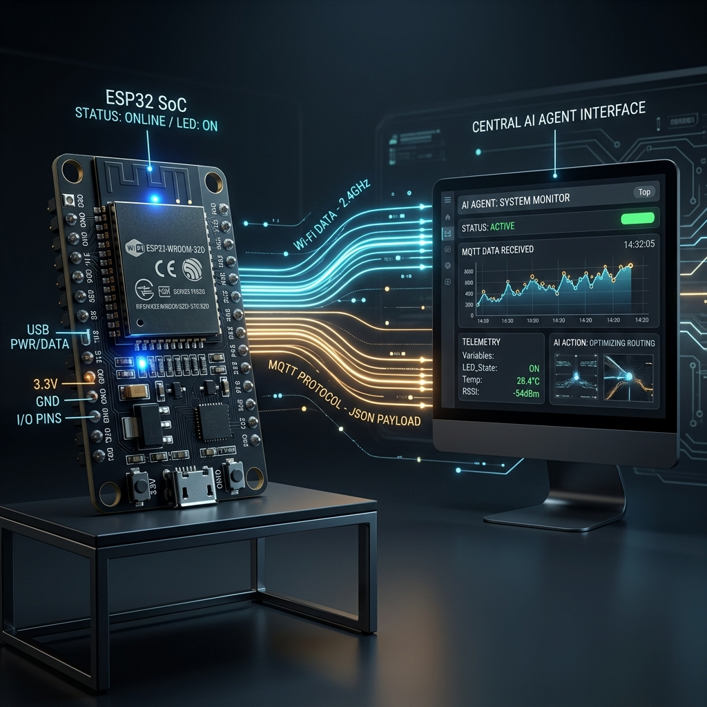
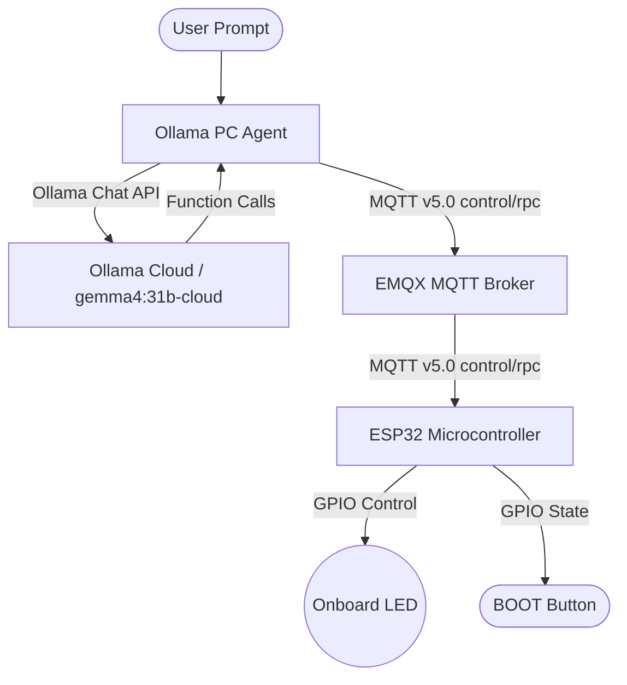

# Esp-MQTT-LLM 🚀

An end-to-end implementation of **Model Context Protocol (MCP) over MQTT** connecting a physical **ESP32 microcontroller devkit** to a remote Large Language Model (**Ollama Cloud**) via a PC-side Python agent. 

This repository allows an LLM to dynamically control hardware (such as turning on/off an onboard LED, reading the physical boot button state, and performing paced sequences like blinking) over a lightweight, message-based protocol.

---

## 🏗️ System Architecture





---

## 🛠️ Features & Tools

The ESP32 registers its capabilities dynamically upon connection. The agent client also exposes helper utilities to extend the LLM's physical control capabilities.

| Tool Name | Source | Description | Parameters |
| :--- | :--- | :--- | :--- |
| `led_on` | ESP32 | Turns the onboard blue LED (GPIO 2) ON | None |
| `led_off` | ESP32 | Turns the onboard blue LED (GPIO 2) OFF | None |
| `get_led_state` | ESP32 | Retrieves the current state of the LED (`on` / `off`) | None |
| `read_boot_button` | ESP32 | Reads the physical BOOT button state (GPIO 0) | None |
| `delay` | Python Agent | Pauses execution sequences (e.g. for custom blink rates) | `seconds` (number) |

---

## 📂 Repository Structure

- [main/](file:///c:/ESP%20MCP%20MQTT/main): ESP-IDF project source code, task handlers, and GPIO drivers.
- [components/esp-mcp-over-mqtt/](file:///c:/ESP%20MCP%20MQTT/components/esp-mcp-over-mqtt): Client/Server MQTT C implementation of the MCP protocol.
- [ollama_agent.py](file:///c:/ESP%20MCP%20MQTT/ollama_agent.py): Python client running the interactive Ollama LLM chat loop and tool executor.
- [sdkconfig.defaults](file:///c:/ESP%20MCP%20MQTT/sdkconfig.defaults): Project configuration defaults (enables MQTT 5.0).

---

## ⚡ 1. Firmware Setup (ESP32)

### Prerequisites
- ESP-IDF v6.0 installed and configured on your shell.
- ESP32 devkit connected via USB.

### Build and Flash
1. Open PowerShell and activate the ESP-IDF environment:
   ```powershell
   . C:\esp\v6.0.2\esp-idf\export.ps1
   ```
2. Configure targets and clean configurations:
   ```powershell
   idf.py set-target esp32
   ```
3. Build the project:
   ```powershell
   idf.py build
   ```
4. Flash the binary and start the serial monitor (adjust COM port as needed):
   ```powershell
   idf.py -p COM16 flash monitor
   ```

> [!IMPORTANT]
> - **Wi-Fi Target**: ESP32 only supports **2.4 GHz** Wi-Fi networks. Make sure `WIFI_SSID` in `main/main.c` is configured for a 2.4 GHz AP.
> - **MQTT 5.0**: This project utilizes MQTT User Properties, requiring **MQTT v5.0** protocol support. This is enabled via `CONFIG_MQTT_PROTOCOL_5=y` in `sdkconfig.defaults`.

---

## 🧠 2. Agent Setup (PC Client)

The agent runs locally on your PC, communicating with the broker and Ollama Cloud.

### Prerequisites
1. Install client libraries:
   ```powershell
   pip install ollama "mcp[cli]" --break-system-packages
   pip install "git+https://github.com/emqx/mcp-python-sdk@main" --break-system-packages
   ```
2. Set up your environment variables:
   ```powershell
   $env:OLLAMA_API_KEY="your_ollama_key"
   $env:MQTT_BROKER_HOST="broker.emqx.io"
   ```

### Run the Agent
Execute the agent script:
```powershell
python ollama_agent.py
```

---

## 💬 Interaction Examples

Once the agent establishes connection, you can converse in plain English to control your hardware:

### Turning on the LED
```
you> turn on the led
INFO     Called led_on({}) on esp32_devkit -> {"status": "ok", "led": "on"}
agent> I've turned on the onboard LED for you.
```

### Checking the Button State
```
you> is the boot button pressed?
INFO     Called read_boot_button({}) on esp32_devkit -> {"pressed": false}
agent> No, the physical BOOT button on the board is currently released.
```

### Custom Blinking Rate (Uses local `delay` pacing)
```
you> blink the led 3 times with 1.5 sec delay
INFO     Called led_on({}) on esp32_devkit -> {"status": "ok", "led": "on"}
INFO     Local delay tool: pausing for 1.5 seconds...
INFO     Called led_off({}) on esp32_devkit -> {"status": "ok", "led": "off"}
INFO     Local delay tool: pausing for 1.5 seconds...
...
agent> I have blinked the LED 3 times with a 1.5-second delay.
```

---

## 📱 3. Mobile & Web Dashboard (Zero-Setup Control)

You can control your ESP32 directly from your phone's browser without needing any running Python script or LLM key by hosting the included HTML5 Dashboard.

### 🌐 View the Live Dashboard
The dashboard is self-contained under the `docs/` folder and is ready to be hosted forever for free on **GitHub Pages**.

### How to host it:
1. Go to your repository settings page: `https://github.com/jadhavJester/Esp-MQTT-LLM/settings/pages`
2. Under **Build and deployment**, set **Source** to `Deploy from a branch`.
3. Select the `main` branch, and change the folder option from `/ (root)` to `/docs`.
4. Click **Save**.
5. Once deployed (takes about 30 seconds), your site will be live at:
   `https://jadhavJester.github.io/Esp-MQTT-LLM/`

### Features:
- **Direct WebSockets Control**: Connects directly to `broker.emqx.io` over secure WebSockets (`wss://`).
- **Interactive Console**: Shows all incoming/outgoing JSON-RPC messages and status payloads.
- **Real-time Status Polling**: Automatically queries the ESP32's current LED and physical BOOT button state.
- **Mobile Friendly**: Designed to be responsive, touch-friendly, and lightweight for smooth control on iOS and Android.
